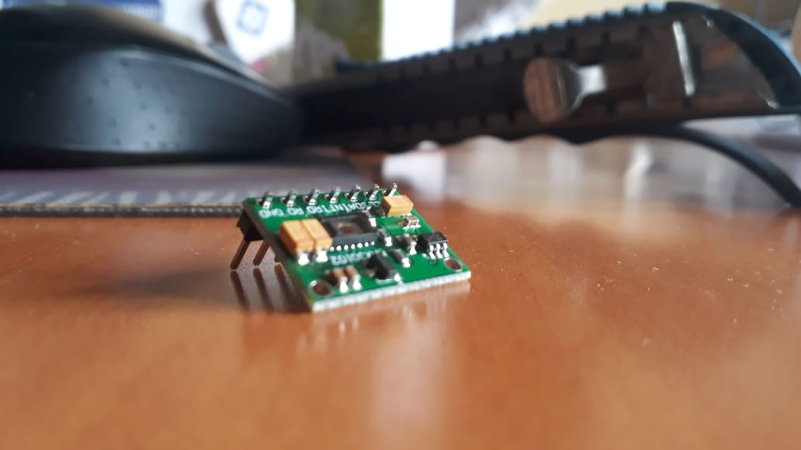

# SpO2-Pulse-Monitoring-System
IoT-based Pulse and Blood-Oxygen(SpO2) Monitoring System, which will allow doctors to monitor the Pulse and Blood-Oxygen level of isolated people remotely through the Blynk IoT App.

#### Project Demo on YouTube: https://youtu.be/mLJu1mKp7wM

[Project Report | PDF](https://github.com/RAvengineer/SpO2-Pulse-Monitoring-System/blob/main/Documents/Self%20Pulse%20and%20Blood-Oxygen%20Monitoring%20System%20Report.pdf)

## How to use?
1. Open VS Code
2. Install Platform IO extension
3. Open the [./Programs](/Programs) folder as a new `Node-MCU` project
4. Install the dependencies in [platformio.ini](Programs/platformio.ini) file
5. Upload the code to Node-MCU

## Features
- [x] Read Pulse from the MAX30102 sensor
- [x] Read Blood-oxygen level (SpO2) from the MAX30102 sensor
- [x] Upload the data to Blynk Server
- [x] Notify the user, when level enters critical region

## Components
### Hardware
  - Node MCU ESP8266 Wi-Fi Module Ver 1.0
  - MAX30102 Pulse Oximeter and Heart-Rate Sensor

</img>
  - Bread Board
  - Connection Wires
  - Soldering Kit
  - USB Data Cable
  - LED
### Software
  - Blynk IoT Application (Android/ioS)
  - Arduino IDE
  - Blynk Libraries

## Team Members
### Rahul Bera

### Prakrit Raj

